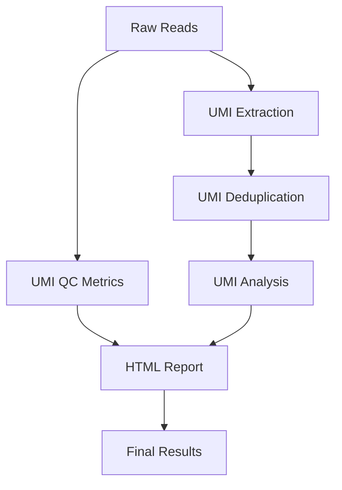

# umi-amplicon

[](https://www.nextflow.io/)
[](https://www.docker.com/)

## Introduction

**umi-amplicon** is a bioinformatics best-practice analysis pipeline for UMI-tagged amplicon sequencing data.

The pipeline is built using [Nextflow](https://www.nextflow.io), a workflow tool to run tasks across multiple compute infrastructures in a very portable manner. It uses Docker containers making installation trivial and results highly reproducible. The [Nextflow DSL2](https://www.nextflow.io/docs/latest/dsl2.html) implementation of this pipeline uses one container per process which makes it much easier to maintain and update software dependencies. Where possible, these processes have been submitted to and installed from [nf-core/modules](https://github.com/nf-core/modules)!

On release, automated continuous integration tests run the pipeline on a full-sized dataset on the AWS cloud infrastructure. This ensures that the pipeline works on AWS, has sensible resource allocation defaults set to run on real-world datasets, and permits the persistent storage of results to be built into a standard structure. Results can be automatically transferred to various cloud providers.

## Pipeline summary

The umi-amplicon pipeline performs the following steps:

1. **UMI Quality Control** - Comprehensive QC metrics including:
   - UMI diversity analysis
   - UMI collision rate calculation
   - UMI quality score distribution
   - UMI length distribution
   - UMI composition analysis

2. **UMI Extraction** - Extract UMI sequences from raw sequencing data:
   - Pattern-based UMI extraction
   - Quality-based filtering
   - Extraction statistics

3. **UMI Deduplication** - Remove duplicate reads based on UMI sequences:
   - Directional deduplication
   - Quality threshold filtering
   - Deduplication statistics

4. **UMI Analysis** - Advanced analysis of UMI sequences:
   - UMI frequency distribution
   - UMI network analysis
   - UMI composition analysis
   - Quality metrics

5. **Report Generation** - Comprehensive HTML report with:
   - Interactive visualizations
   - Quality control metrics
   - Analysis results
   - Summary statistics

## Quick Start

1. Install [`Nextflow`](https://www.nextflow.io/docs/latest/getstarted.html#installation) (`>=21.04.0`)

2. Install [`Docker`](https://docs.docker.com/engine/installation/) for full pipeline reproducibility

3. Download the pipeline and test it on a minimal dataset with a single command:

```bash
nextflow run umi-amplicon -profile test,<docker/institutional> --outdir <OUTDIR>
```

> Please check [nf-core/configs](https://github.com/nf-core/configs#documentation) to see if a custom config file to run nf-core pipelines already exists for your Institution. If so, you can simply use `-profile <institutional>` in your command. This will enable `docker` and set the appropriate execution settings for your local compute environment.

4. Start running your own analysis!

```bash
nextflow run umi-amplicon \
    --input samplesheet.csv \
    --outdir <OUTDIR> \
    --genome <GENOME> \
    -profile <docker/institutional>
```

## Documentation

The umi-amplicon pipeline comes with documentation about the pipeline: [usage](https://nf-co.re/umi-amplicon/usage), [parameters](https://nf-co.re/umi-amplicon/parameters) and [output](https://nf-co.re/umi-amplicon/output).


## Citation

If you use umi-amplicon for your analysis please cite it and nf-core for credit. 

You can cite the `nf-core` publication as follows:

> **The nf-core framework for community-curated bioinformatics pipelines.**
>
> Philip Ewels, Alexander Peltzer, Sven Fillinger, Harshil Patel, Johannes Alneberg, Andreas Wilm, Maxime Ulysse Garcia, Paolo Di Tommaso & Sven Nahnsen.
>
> _Nat Biotechnol._ 2020 Feb 13. doi: [10.1038/s41587-020-0439-x](https://dx.doi.org/10.1038/s41587-020-0439-x).

## Pipeline Overview



## UMI Analysis Features

### Quality Control Metrics
- **UMI Diversity**: Measures the uniqueness of UMI sequences
- **Collision Rate**: Calculates the frequency of identical UMI sequences
- **Quality Scores**: Analyzes the quality of UMI sequences
- **Length Distribution**: Examines UMI length patterns
- **Composition Analysis**: Studies base composition of UMI sequences

### Analysis Pipeline
- **Pattern-based Extraction**: Flexible UMI pattern recognition
- **Quality Filtering**: Removes low-quality UMI sequences
- **Deduplication**: Removes duplicate reads based on UMI sequences
- **Network Analysis**: Identifies relationships between UMI sequences
- **Statistical Analysis**: Comprehensive statistical metrics

### Visualization
- **Interactive Plots**: Dynamic visualizations for exploration
- **Quality Plots**: Visual representation of quality metrics
- **Network Plots**: Graphical representation of UMI relationships
- **Heatmaps**: Matrix visualization of UMI frequencies

## Parameters

### Input Parameters
- `--input`: Path to input samplesheet (required)
- `--outdir`: Path to output directory (required)

### UMI Parameters
- `--umi_length`: Length of UMI sequences (default: 12)
- `--umi_pattern`: Pattern for UMI extraction (default: NNNNNNNNNNNN)
- `--umi_method`: UMI extraction method (default: directional)
- `--umi_quality_threshold`: Minimum quality score (default: 10)
- `--umi_collision_rate_threshold`: Maximum collision rate (default: 0.1)
- `--umi_diversity_threshold`: Minimum UMI diversity (default: 1000)

### Analysis Parameters
- `--skip_umi_qc`: Skip UMI quality control
- `--skip_umi_analysis`: Skip UMI analysis
- `--skip_report`: Skip HTML report generation

## Output

The pipeline produces the following outputs:

- **UMI QC Metrics**: Quality control statistics and plots
- **Extracted Sequences**: UMI-extracted sequencing data
- **Deduplicated Data**: UMI-deduplicated sequencing data
- **Analysis Results**: Comprehensive UMI analysis
- **HTML Report**: Interactive report with visualizations
- **MultiQC Report**: Quality control summary

## Usage Examples

### Basic Usage
```bash
nextflow run umi-amplicon \
    --input samplesheet.csv \
    --outdir results/
```

### Advanced Usage
```bash
nextflow run umi-amplicon \
    --input samplesheet.csv \
    --outdir results/ \
    --umi_length 12 \
    --umi_pattern NNNNNNNNNNNN \
    --umi_method directional \
    --umi_quality_threshold 15 \
    --umi_collision_rate_threshold 0.05 \
    --umi_diversity_threshold 2000
```

### Custom Configuration
```bash
nextflow run umi-amplicon \
    --input samplesheet.csv \
    --outdir results/ \
    -profile custom \
    -c custom.config
```

## Troubleshooting

### Common Issues
1. **Memory Issues**: Increase memory allocation for large datasets
2. **Quality Issues**: Adjust quality thresholds for your data
3. **Pattern Issues**: Verify UMI patterns match your experimental design

## Acknowledgments

- The nf-core community for their support and feedback
- The UMI-tools developers for their excellent software
- The Nextflow community for their continuous improvements
- All contributors who have helped improve this pipeline

