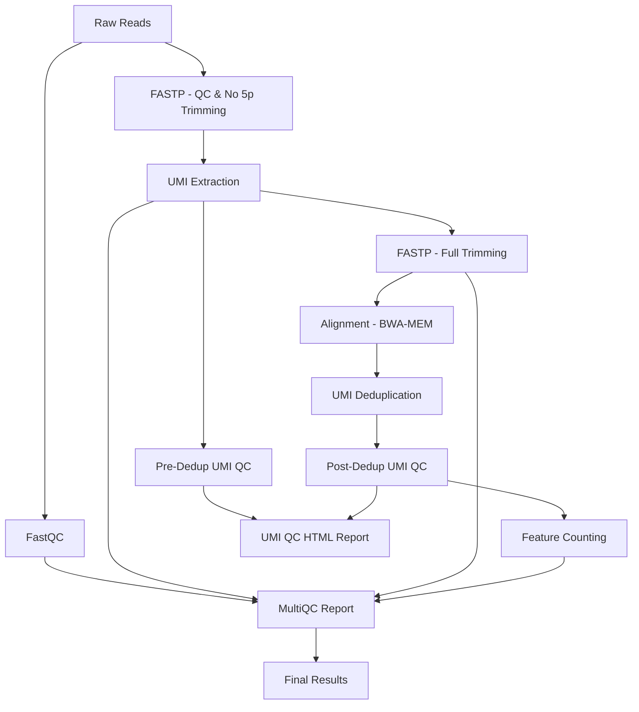

# umi-amplicon

[](https://www.nextflow.io/)
[](https://www.docker.com/)
[](https://docs.conda.io/en/latest/)

## Introduction

**umi-amplicon** is a bioinformatics best-practice analysis pipeline for UMI-tagged amplicon sequencing data.

The pipeline is built using [Nextflow](https://www.nextflow.io), a workflow tool to run tasks across multiple compute infrastructures in a very portable manner. It uses Docker containers and conda environments making installation trivial and results highly reproducible. The [Nextflow DSL2](https://www.nextflow.io/docs/latest/dsl2.html) implementation of this pipeline uses one container per process which makes it much easier to maintain and update software dependencies. Where possible, these processes have been submitted to and installed from [nf-core/modules](https://github.com/nf-core/modules)!

## TODO
   build nf-core test & ensure CI ready 

## Pipeline summary

The umi-amplicon pipeline performs the following steps:

### Critical Workflow Design
> **⚠️ Two-Round FASTP Strategy**: This pipeline uses a novel **two-round FASTP approach** to ensure UMI integrity:
> 1. **First FASTP** (before UMI extraction): Adapter trimming, quality filtering, 3' trimming - but **NO 5' trimming** to preserve UMIs
> 2. **UMI Extraction**: Extract intact UMIs from 5' end and move to read headers
> 3. **Second FASTP** (after UMI extraction): Full trimming including 5' end, merging - UMIs are now safe in headers

> **⚠️ UMI Design Assumption**: This pipeline assumes that **UMIs are present at the 5' end of Read 1**. For paired-end data, the UMI is extracted from Read 1 only. This is a common experimental design for amplicon sequencing where UMIs are incorporated during the first PCR primer.

### Workflow Steps

1. **FastQC** - Quality control of raw reads:
   - Raw read quality assessment
   - Adapter content detection
   - Base quality distribution

2. **FASTP Round 1** - Initial QC and filtering (preserves 5' UMIs):
   - Adapter detection and trimming
   - Quality filtering (removes poor quality reads)
   - 3' end trimming only
   - **Critical**: NO 5' trimming to preserve UMI sequences
   - Baseline QC metrics

3. **FastQC** - Quality check after first filtering:
   - Assess quality improvements from filtering
   - Verify 5' end integrity before UMI extraction

4. **UMI Extraction** - Extract UMI sequences from filtered reads:
   - Pattern-based UMI extraction using `umi_tools extract`
   - UMI moved to read headers (safe from trimming)
   - Extraction statistics and logs
   - **Critical**: Uses output from FASTP Round 1 (5' end intact)

5. **FASTP Round 2** - Complete preprocessing with full trimming:
   - Full 5' and 3' end trimming (UMIs now in headers)
   - Adapter trimming
   - Quality filtering
   - Read merging (for paired-end amplicon data, not implemented yet TODO: merge if high-merging rate)
   - Final quality statistics

6. **FastQC** - Quality check after full processing:
   - Verify final read quality before alignment
   - Assess impact of full trimming and merging

7. **Pre-Deduplication UMI QC** - Comprehensive QC metrics on extracted UMIs:
   - UMI diversity analysis (Shannon entropy, complexity score)
   - UMI collision rate estimation
   - UMI quality score analysis
   - Family size distribution
   - Singleton rate calculation
   - UMI composition analysis

8. **Alignment** - Map processed reads to reference genome:
   - BWA-MEM alignment
   - Sorted BAM output with proper UMI tags
   - Alignment QC metrics (SAMTOOLS, Picard)
   - **Required for accurate UMI deduplication**

9. **UMI Deduplication** - Remove PCR duplicates using UMI + genomic position:
   - Performed on aligned BAM files using `umi_tools dedup`
   - Uses genomic coordinates + UMI for accurate deduplication
   - Directional network-based deduplication method
   - Error correction and UMI family grouping
   - Outputs deduplicated BAM files

10. **Post-Deduplication UMI QC** - Deduplication performance metrics:
   - UMI family statistics (count, sizes, distribution)
   - Edit distance analysis between UMIs (error correction/clustering)
   - Deduplication rate and efficiency
   - UMI clustering metrics
   - Singleton family rate
   - Mean/median edit distance
   - Error correction rate

11. **UMI QC HTML Report** - Comprehensive interactive report:
   - **Single consolidated report** with pre- and post-dedup metrics
   - Interactive Plotly visualizations
   - Family size distribution charts
   - Edit distance distribution (UMI clustering)
   - Deduplication summary gauges
   - Automated quality assessment
   - Output: `umi_qc_postdedup/reports/sample.umi_postdedup_report.html`

12. **MultiQC Report** - Comprehensive HTML report aggregating:
   - All QC metrics from each step
   - Interactive visualizations
   - UMI diversity plots
   - Deduplication statistics
   - Alignment summaries

## Quick Start

1. Install [`Nextflow`](https://www.nextflow.io/docs/latest/getstarted.html#installation) (`>=21.04.0`)

2. Install either [`Docker`](https://docs.docker.com/engine/installation/) or [`Conda`](https://docs.conda.io/en/latest/miniconda.html) for full pipeline reproducibility

3. Download the pipeline and test it on a minimal dataset with a single command:

```bash
# Using Docker
nextflow run umi-amplicon -profile test,docker --outdir <OUTDIR>

# Using Conda
nextflow run umi-amplicon -profile test,conda --outdir <OUTDIR>
```

> Please check [nf-core/configs](https://github.com/nf-core/configs#documentation) to see if a custom config file to run nf-core pipelines already exists for your Institution. If so, you can simply use `-profile <institutional>` in your command. This will enable `docker` and set the appropriate execution settings for your local compute environment.

4. Start running your own analysis!

```bash
# Using Docker
nextflow run umi-amplicon \
    --input samplesheet.csv \
    --outdir <OUTDIR> \
    --genome <GENOME> \
    --umi_pattern NNNNNNNNNNNN
    --umi_length 12
    -profile docker

# Using Conda
nextflow run umi-amplicon \
    --input samplesheet.csv \
    --outdir <OUTDIR> \
    --genome <GENOME> \
    --umi_pattern NNNNNNNNNNNN
    --umi_length 12
    -profile conda
```

## Documentation

The umi-amplicon pipeline comes with documentation about the pipeline: [usage](https://nf-co.re/umi-amplicon/usage), [parameters](https://nf-co.re/umi-amplicon/parameters) and [output](https://nf-co.re/umi-amplicon/output).


## Citation

If you use umi-amplicon for your analysis please cite it and nf-core for credit. 

You can cite the `nf-core` publication as follows:

> **The nf-core framework for community-curated bioinformatics pipelines.**
>
> Philip Ewels, Alexander Peltzer, Sven Fillinger, Harshil Patel, Johannes Alneberg, Andreas Wilm, Maxime Ulysse Garcia, Paolo Di Tommaso & Sven Nahnsen.
>
> _Nat Biotechnol._ 2020 Feb 13. doi: [10.1038/s41587-020-0439-x](https://dx.doi.org/10.1038/s41587-020-0439-x).

## Pipeline Overview



## UMI Analysis Features

### Quality Control Metrics
- **UMI Diversity**: Measures the uniqueness of UMI sequences
- **Collision Rate**: Calculates the frequency of identical UMI sequences
- **Quality Scores**: Analyzes the quality of UMI sequences

### Analysis Pipeline
- **Pattern-based Extraction**: Flexible UMI pattern recognition
- **Quality Filtering**: Removes low-quality UMI sequences
- **Deduplication**: Removes duplicate reads based on UMI sequences and aligned genome coordiates 
- **Network Analysis**: Identifies relationships between UMI sequences
- **Statistical Analysis**: Comprehensive statistical metrics

### Visualization
- **Interactive Plots**: Dynamic visualizations for exploration
- **Quality Plots**: Visual representation of quality metrics

## Parameters

### Input Parameters
- `--input`: Path to input samplesheet (required)
- `--outdir`: Path to output directory (required)

### UMI Parameters
- `--umi_length`: Length of UMI sequences (default: 12)
- `--umi_pattern`: Pattern for UMI extraction from Read 1 (default: NNNNNNNNNNNN)
  - **Note**: UMIs are extracted from Read 1 only (or 5' end of merged reads)
  - Use 'N' for random nucleotides in the UMI
  - Example: `NNNNNNNNNNNN` for a 12bp random UMI
- `--umi_method`: UMI extraction method (default: directional)
- `--umi_quality_threshold`: Minimum quality score (default: 10)
- `--umi_collision_rate_threshold`: Maximum collision rate (default: 0.1)
- `--umi_diversity_threshold`: Minimum UMI diversity (default: 1000)

## Output

The pipeline produces the following outputs:

- **UMI QC Metrics**: Quality control statistics and plots
- **Extracted Sequences**: UMI-extracted sequencing data
- **Deduplicated Data**: UMI-deduplicated sequencing data
- **Analysis Results**: Comprehensive UMI analysis
- **HTML Report**: Interactive report with visualizations
- **MultiQC Report**: Quality control summary

## Usage Examples

### Basic Usage
```bash
nextflow run umi-amplicon \
    --input samplesheet.csv \
    --outdir results/
```

### Advanced Usage
```bash
nextflow run umi-amplicon \
    --input samplesheet.csv \
    --outdir results/ \
    --umi_length 12 \
    --umi_pattern NNNNNNNNNNNN \
    --umi_method directional \
    --umi_quality_threshold 15 \
    --umi_collision_rate_threshold 0.05 \
    --umi_diversity_threshold 2000
```

### Custom Configuration
```bash
nextflow run umi-amplicon \
    --input samplesheet.csv \
    --outdir results/ \
    -profile custom \
    -c custom.config
```

## Troubleshooting

### Common Issues
1. **Memory Issues**: Increase memory allocation for large datasets
2. **Quality Issues**: Adjust quality thresholds for your data
3. **Pattern Issues**: Verify UMI patterns match your experimental design

## Acknowledgments

- The nf-core community for their support and feedback
- The UMI-tools developers for their excellent software
- The Nextflow community for their continuous improvements
- All contributors who have helped improve this pipeline

