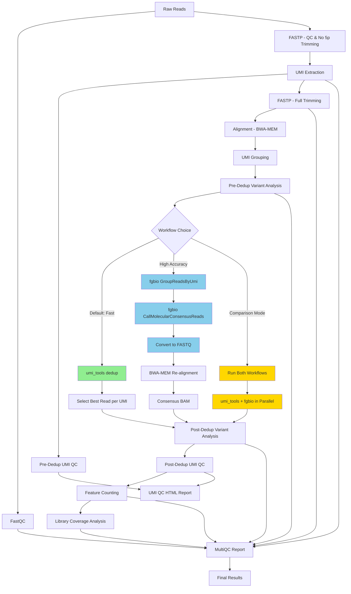

# umi-amplicon

[](https://www.nextflow.io/)
[](https://www.docker.com/)
[](https://docs.conda.io/en/latest/)

## Introduction

**umi-amplicon** is a comprehensive bioinformatics pipeline for UMI-tagged amplicon sequencing analysis with advanced quality control and flexible deduplication strategies.

### What's New in This Version

🎉 **Dual Workflow System**
- Both `umi_tools dedup` and `fgbio consensus` run by default for comprehensive validation
- Complete fgbio workflow with automatic re-alignment of consensus sequences
- Direct comparison of deduplication methods for quality assurance

🔬 **Advanced UMI Variant Analysis**
- Pre- and post-deduplication multi-variant UMI detection
- Automated classification of sequencing errors vs UMI collisions
- Specificity metrics to validate deduplication effectiveness

📊 **Enhanced Quality Control**
- Library coverage analysis with evenness metrics
- Interactive HTML reports with Plotly visualizations
- Comprehensive MultiQC integration

### Key Features

✨ **Dual Deduplication Workflows (Both Run by Default)**
- **umi_tools dedup** - Fast, standard deduplication (always runs)
- **fgbio consensus** - High-accuracy consensus building (optional)
- **DEFAULT: Runs BOTH** for comprehensive analysis and validation
- **Fast mode**: Use `--skip_fgbio` to run only umi_tools

🔬 **Advanced UMI Analysis**
- **Variant Analysis** - Assess multi-variant UMIs (pre & post-dedup)
- **Specificity Metrics** - Validate deduplication effectiveness
- **Error Detection** - Identify sequencing errors vs UMI collisions

📊 **Comprehensive QC**
- **Library Coverage** - Coverage metrics with evenness analysis
- **Interactive Reports** - HTML reports with Plotly visualizations
- **MultiQC Integration** - Aggregated metrics from all steps

🛠️ **Production-Ready**
- Built with [Nextflow DSL2](https://www.nextflow.io/docs/latest/dsl2.html)
- Docker/Conda support for reproducibility
- Uses [nf-core modules](https://github.com/nf-core/modules) where possible

## TODO
   build nf-core test & ensure CI ready 

## Pipeline summary

The umi-amplicon pipeline performs the following steps:

### Critical Workflow Design
> ** Two-Round FASTP Strategy**: This pipeline uses a novel **two-round FASTP approach** to ensure UMI integrity:
> 1. **First FASTP** (before UMI extraction): Adapter trimming, quality filtering, 3' trimming - but **NO 5' trimming** to preserve UMIs
> 2. **UMI Extraction**: Extract intact UMIs from 5' end and move to read headers
> 3. **Second FASTP** (after UMI extraction): Full trimming including 5' end, merging - UMIs are now safe in headers

> ** UMI Design Assumption**: This pipeline assumes that **UMIs are present at the 5' end of Read 1**. For paired-end data, the UMI is extracted from Read 1 only. This is a common experimental design for amplicon sequencing where UMIs are incorporated during the first PCR primer.

### Workflow Steps

1. **FastQC** - Quality control of raw reads:
   - Raw read quality assessment
   - Adapter content detection
   - Base quality distribution

2. **FASTP Round 1** - Initial QC and filtering (preserves 5' UMIs):
   - Adapter detection and trimming
   - Quality filtering (removes poor quality reads)
   - 3' end trimming only
   - **Critical**: NO 5' trimming to preserve UMI sequences
   - Baseline QC metrics

3. **FastQC** - Quality check after first filtering:
   - Assess quality improvements from filtering
   - Verify 5' end integrity before UMI extraction

4. **UMI Extraction** - Extract UMI sequences from filtered reads:
   - Pattern-based UMI extraction using `umi_tools extract`
   - UMI moved to read headers (safe from trimming)
   - Extraction statistics and logs
   - **Critical**: Uses output from FASTP Round 1 (5' end intact)

5. **FASTP Round 2** - Complete preprocessing with full trimming:
   - Full 5' and 3' end trimming (UMIs now in headers)
   - Adapter trimming
   - Quality filtering
   - **Maintains paired-end structure** (no merging for optimal UMI deduplication)
   - Final quality statistics

6. **FastQC** - Quality check after full processing:
   - Verify final read quality before alignment
   - Assess impact of full trimming and merging

7. **Pre-Deduplication UMI QC** - Comprehensive QC metrics on extracted UMIs:
   - UMI diversity analysis (Shannon entropy, complexity score)
   - UMI collision rate estimation
   - UMI quality score analysis
   - Family size distribution
   - Singleton rate calculation
   - UMI composition analysis

8. **Alignment** - Map processed reads to reference genome:
   - BWA-MEM alignment
   - Sorted BAM output with proper UMI tags
   - Alignment QC metrics (SAMTOOLS, Picard)
   - **Required for accurate UMI deduplication**

9. **UMI Grouping** - Inspect UMI groups before deduplication:
   - Groups reads by UMI and genomic position using `umi_tools group`
   - Outputs grouped BAM file with group tags
   - Generates groups.tsv file showing UMI groupings
   - **For inspection and QC purposes** - helps understand UMI clustering

10. **Pre-Deduplication Variant Analysis** - Assess UMI specificity:
   - Analyzes multi-variant UMIs (same UMI, different sequences)
   - Classifies variants as:
     - Likely sequencing errors (major variant >90%)
     - Likely UMI collisions (different genomic positions)
     - Ambiguous cases
   - Calculates baseline specificity metrics

11. **UMI Deduplication/Consensus** - Dual workflow (BOTH run by default):
   
   **Workflow A: umi_tools dedup (always runs)**
   - Performed on aligned BAM files using `umi_tools dedup`
   - Uses genomic coordinates + UMI for accurate deduplication
   - Directional network-based deduplication method
   - Selects best read from each UMI family
   - Fast and efficient for high-quality data
   
   **Workflow B: fgbio consensus (runs by default, skip with `--skip_fgbio`)**
   - **UMI Transfer**: Converts FASTQ to unmapped BAM with `fgbio FastqToBam`
     - Extracts UMI from read names (added by umi_tools extract)
     - Stores UMI in RX tag (required by fgbio)
     - Follows nf-core/fastquorum best practices
   - **Initial Alignment**: Aligns unmapped BAM with BWA-MEM (preserves RX tags)
   - **UMI Grouping**: Groups reads by UMI using `fgbio GroupReadsByUmi`
   - **Consensus Calling**: Builds consensus sequences using `fgbio CallMolecularConsensusReads`
   - **Re-alignment**: Converts consensus BAM to FASTQ and re-aligns with BWA-MEM
   - **QC & Analysis**: Indexes consensus BAM for downstream analysis
   - Leverages multiple reads for error correction
   - Higher accuracy but slower
   
   **Both workflows produce:**
   - Deduplicated/consensus BAM files
   - Variant analysis reports
   - Feature counts (if GTF provided)
   - Library coverage metrics

12. **Post-Deduplication Variant Analysis** - Assess deduplication effectiveness:
   - **umi_tools**: Re-analyzes multi-variant UMIs after deduplication
   - **fgbio**: Analyzes multi-variant UMIs in consensus sequences
   - Compares pre/post-dedup specificity
   - Validates deduplication/consensus performance
   - Identifies remaining problematic UMIs
   - Enables direct comparison between methods

13. **Post-Deduplication UMI QC** - Deduplication performance metrics (umi_tools only):
   - UMI family statistics (count, sizes, distribution)
   - Edit distance analysis between UMIs (error correction/clustering)
   - Deduplication rate and efficiency
   - UMI clustering metrics
   - Singleton family rate
   - Mean/median edit distance
   - Error correction rate

14. **Feature Counting** - Count reads per amplicon/feature (both workflows):
   - Uses `featureCounts` from Subread package
   - **umi_tools**: Counts deduplicated reads mapping to each feature
   - **fgbio**: Counts consensus reads mapping to each feature
   - Generates separate count matrices for direct comparison
   - Requires GTF annotation file (`--gtf`)

15. **Library Coverage Analysis** - Comprehensive coverage metrics (both workflows):
   - **umi_tools**: Coverage from deduplicated reads
   - **fgbio**: Coverage from consensus reads
   - Calculates library coverage (% of reference sequences detected)
   - **Evenness metrics**:
     - Shannon entropy - diversity measure
     - Simpson index - probability two random reads are from different features
     - Pielou's evenness - uniformity of distribution
     - Gini coefficient - inequality measure
   - **Distribution analysis**:
     - Count distribution plots (histogram, cumulative)
     - Top features visualization
     - Summary statistics
   - Outputs: text report, JSON for MultiQC, PNG plots

16. **UMI QC HTML Report** - Comprehensive interactive report:
   - **Single consolidated report** with pre- and post-dedup metrics
   - Interactive Plotly visualizations
   - Family size distribution charts
   - Edit distance distribution (UMI clustering)
   - Deduplication summary gauges
   - Automated quality assessment
   - Output: `umi_qc_postdedup/reports/sample.umi_postdedup_report.html`

17. **MultiQC Report** - Comprehensive HTML report aggregating:
   - All QC metrics from each step
   - Interactive visualizations
   - UMI diversity plots
   - Deduplication/consensus statistics
   - Alignment summaries
   - Library coverage metrics
   - Variant analysis metrics

## Quick Start

1. Install [`Nextflow`](https://www.nextflow.io/docs/latest/getstarted.html#installation) (`>=21.04.0`)

2. Install either [`Docker`](https://docs.docker.com/engine/installation/) or [`Conda`](https://docs.conda.io/en/latest/miniconda.html) for full pipeline reproducibility

3. Download the pipeline and test it on a minimal dataset with a single command:

```bash
# Using Docker
nextflow run umi-amplicon -profile docker --outdir <OUTDIR>

# Using Conda
nextflow run umi-amplicon -profile conda --outdir <OUTDIR>
```


4. Start running your own analysis!

```bash
# Using Docker
nextflow run umi-amplicon \
    --input samplesheet.csv \
    --outdir <OUTDIR> \
    --fasta <FASTA> \
    --umi_pattern NNNNNNNNNNNN
    --umi_length 12
    -profile docker

# Using Conda
nextflow run umi-amplicon \
    --input samplesheet.csv \
    --outdir <OUTDIR> \
    --fasta <FASTA> \
    --umi_pattern NNNNNNNNNNNN
    --umi_length 12
    -profile conda
```

## Citation

If you use umi-amplicon for your analysis please cite it and nf-core for credit. 

You can cite the `nf-core` publication as follows:

> **The nf-core framework for community-curated bioinformatics pipelines.**
>
> Philip Ewels, Alexander Peltzer, Sven Fillinger, Harshil Patel, Johannes Alneberg, Andreas Wilm, Maxime Ulysse Garcia, Paolo Di Tommaso & Sven Nahnsen.
>
> _Nat Biotechnol._ 2020 Feb 13. doi: [10.1038/s41587-020-0439-x](https://dx.doi.org/10.1038/s41587-020-0439-x).

## Pipeline Overview



## UMI Analysis Features

### Quality Control Metrics
- **UMI Diversity**: Measures the uniqueness of UMI sequences
- **Collision Rate**: Calculates the frequency of identical UMI sequences
- **Quality Scores**: Analyzes the quality of UMI sequences

### Analysis Pipeline
- **Pattern-based Extraction**: Flexible UMI pattern recognition
- **Quality Filtering**: Removes low-quality UMI sequences
- **Deduplication**: Removes duplicate reads based on UMI sequences and aligned genome coordiates 
- **Network Analysis**: Identifies relationships between UMI sequences
- **Statistical Analysis**: Comprehensive statistical metrics

### Visualization
- **Interactive Plots**: Dynamic visualizations for exploration
- **Quality Plots**: Visual representation of quality metrics

## Parameters

### Input Parameters
- `--input`: Path to input samplesheet (required)
- `--outdir`: Path to output directory (required)

### UMI Parameters
- `--umi_length`: Length of UMI sequences (default: 12)
- `--umi_pattern`: Pattern for UMI extraction from Read 1 (default: NNNNNNNNNNNN)
  - **Note**: UMIs are extracted from Read 1 only (or 5' end of merged reads)
  - Use 'N' for random nucleotides in the UMI
  - Example: `NNNNNNNNNNNN` for a 12bp random UMI
- `--umi_method`: UMI extraction method (default: directional)
- `--umi_quality_threshold`: Minimum quality score (default: 10)
- `--umi_collision_rate_threshold`: Maximum collision rate (default: 0.1)
- `--umi_diversity_threshold`: Minimum UMI diversity (default: 1000)

## Output

The pipeline produces the following outputs:

### Core Outputs
- **UMI QC Metrics**: Quality control statistics and plots
- **Extracted Sequences**: UMI-extracted sequencing data
- **Deduplicated Data**: UMI-deduplicated sequencing data
- **Analysis Results**: Comprehensive UMI analysis
- **HTML Report**: Interactive report with visualizations
- **MultiQC Report**: Quality control summary

### New Analysis Outputs
- **UMI Grouping Results**:
  - `*_grouped.bam` - BAM file with UMI group tags for inspection
  - `*_grouped.tsv` - TSV file showing which reads belong to which UMI groups
  - `*_grouped.log` - Grouping process log
  
- **UMI Variant Analysis** (Pre & Post-Dedup):
  - `*_umi_variant_analysis.txt` - Detailed report with multi-variant UMIs
  - `*_umi_variant_analysis_mqc.json` - MultiQC integration
  - `*_umi_variant_details.json` - Full data for further analysis
  - **Key Metrics**:
    - UMI Specificity (%)
    - Multi-variant Rate (%)
    - Error Rate (%)
    - Collision Rate (%)

- **Library Coverage Analysis**:
  - `*_library_coverage.txt` - Text report with coverage and evenness metrics
  - `*_library_coverage.json` - JSON format for MultiQC integration
  - `*_distribution.png` - 4-panel visualization:
    - Count distribution histogram
    - Cumulative distribution curve
    - Top 20 features bar chart
    - Summary statistics box

- **fgbio Consensus Outputs** (runs by default):
  - `*_umi-grouped.bam` - Grouped reads by UMI
  - `*_histogram.txt` - UMI family size histogram
  - `*_read-metrics.txt` - Grouping metrics
  - `*_consensus_unmapped.bam` - Unmapped consensus sequences
  - `*_consensus.fastq.gz` - Consensus sequences as FASTQ
  - `*_consensus_aligned.bam` - Re-aligned consensus sequences
  - `*_consensus_aligned.bam.bai` - Index for consensus BAM
  - `*_consensus_variant_analysis.txt` - Variant analysis on consensus
  - `*_consensus_counts.txt` - Feature counts from consensus BAM
  - `*_consensus_coverage.txt` - Library coverage from consensus

## Usage Examples

### Default Usage (Both Methods - Recommended)
```bash
# DEFAULT: Runs BOTH umi_tools dedup AND fgbio consensus
nextflow run umi-amplicon \
    --input samplesheet.csv \
    --fasta <FASTA> \
    --outdir results/ \
    --fgbio_min_reads 3 \
    --fgbio_min_baseq 30 \
    -profile docker
```
**Note**: Both workflows run in parallel. Downstream analysis uses umi_tools results, but both outputs are saved for comprehensive comparison.

### Fast Mode (umi_tools only)
```bash
# Skip fgbio for faster processing (umi_tools only)
nextflow run umi-amplicon \
    --input samplesheet.csv \
    --fasta <FASTA> \
    --outdir results/ \
    --skip_fgbio \
    -profile docker
```

### Custom Configuration
```bash
nextflow run umi-amplicon \
    --input samplesheet.csv \
    --fasta <FASTA> \
    --outdir results/ \
    -profile custom \
    -c custom.config
```

## Parameters

### Required Parameters
| Parameter | Description | Default |
|-----------|-------------|---------|
| `--input` | Path to samplesheet CSV file | - |
| `--fasta` | Path to reference genome FASTA | - |

### UMI Parameters
| Parameter | Description | Default |
|-----------|-------------|---------|
| `--umi_length` | Length of UMI sequence | `12` |
| `--umi_pattern` | UMI pattern (N = random base) | `NNNNNNNNNNNN` |
| `--umi_method` | Deduplication method | `directional` |
| `--umi_quality_filter_threshold` | Min quality for UMI bases | `15` |
| `--umi_collision_rate_threshold` | Max acceptable collision rate | `0.1` |
| `--umi_diversity_threshold` | Min unique UMIs expected | `1000` |

### Read Processing Parameters
| Parameter | Description | Default |
|-----------|-------------|---------|
| `--merge_pairs` | Merge paired-end reads after trimming | `false` |

**Note**: Merging is **not recommended** for UMI deduplication as paired-end structure provides more information for accurate deduplication. Use merging only for specific use cases like very short amplicons.

### Workflow Selection Parameters
| Parameter | Description | Default |
|-----------|-------------|---------|
| `--skip_fgbio` | Skip fgbio consensus (run only umi_tools) | `false` |
| **DEFAULT** | **Both umi_tools and fgbio run** | **Both enabled** |

### fgbio Consensus Parameters
| Parameter | Description | Default |
|-----------|-------------|---------|
| `--fgbio_group_strategy` | UMI grouping strategy (adjacency/identity/edit/paired) | `adjacency` |
| `--fgbio_min_reads` | Minimum reads to form consensus | `1` |
| `--fgbio_min_baseq` | Minimum base quality for consensus calling | `20` |

### Optional Parameters
| Parameter | Description | Default |
|-----------|-------------|---------|
| `--gtf` | GTF annotation file for feature counting | - |
| `--outdir` | Output directory | `./results` |
| `--skip_mosdepth` | Skip coverage analysis | `false` |

## Method Comparison: umi_tools vs fgbio

### When to Use Each Method

**umi_tools dedup (Fast & Standard)**
- ✅ High-quality sequencing data (low error rate)
- ✅ Large datasets requiring fast processing
- ✅ Standard UMI-based deduplication
- ✅ Well-established method with extensive validation
- ⚡ **Speed**: Fast (selects best read per UMI)
- 🎯 **Accuracy**: Good for high-quality data

**fgbio consensus (High Accuracy)**
- ✅ Lower-quality sequencing data
- ✅ Critical applications requiring maximum accuracy
- ✅ Error correction through consensus building
- ✅ Detection of rare variants
- ⚡ **Speed**: Slower (builds consensus from multiple reads)
- 🎯 **Accuracy**: Excellent (error correction via consensus)

**Both Methods (Recommended Default)**
- ✅ Method validation and comparison
- ✅ Quality assurance for critical projects
- ✅ Publication-quality analysis
- ✅ Benchmarking deduplication approaches
- 📊 **Output**: Both results available for comparison

### Technical Differences

| Feature | umi_tools dedup | fgbio consensus |
|---------|----------------|-----------------|
| **Approach** | Select best read | Build consensus sequence |
| **Error Correction** | No | Yes (via consensus) |
| **Output** | Original reads | Consensus sequences |
| **Speed** | Fast | Slower |
| **Memory** | Low | Moderate |
| **Best For** | High-quality data | Error-prone data |
| **Re-alignment** | Not needed | Automatic |

## Quick Reference

### Common Commands

**Run with both methods (default):**
```bash
nextflow run umi-amplicon --input samples.csv --fasta ref.fa -profile docker
```

**Run umi_tools only (fast mode):**
```bash
nextflow run umi-amplicon --input samples.csv --fasta ref.fa --skip_fgbio -profile docker
```

**Adjust fgbio parameters:**
```bash
nextflow run umi-amplicon \
    --input samples.csv \
    --fasta ref.fa \
    --fgbio_min_reads 3 \
    --fgbio_min_baseq 30 \
    --fgbio_group_strategy adjacency \
    -profile docker
```

**Resume a failed run:**
```bash
nextflow run umi-amplicon --input samples.csv --fasta ref.fa -profile docker -resume
```

### Key Output Files

| File | Description |
|------|-------------|
| `umitools_dedup/*.bam` | Deduplicated BAM files (umi_tools) |
| `fgbio_consensus/*_aligned.bam` | Consensus BAM files (fgbio) |
| `umi_variant_analysis/*_prededup.txt` | Pre-dedup variant analysis |
| `umi_variant_analysis/*_postdedup.txt` | Post-dedup variant analysis |
| `library_coverage/*.txt` | Coverage and evenness metrics |
| `multiqc_report.html` | Comprehensive QC report |

## Troubleshooting

### Common Issues

**fgbio "Missing RX tag" Error**
- **Fixed in current version**: Pipeline now uses `fgbio FastqToBam` to properly transfer UMI from read names to RX tags
- The workflow automatically converts FASTQ with UMI in read names (from umi_tools) to BAM with RX tags (for fgbio)
- This follows nf-core/fastquorum best practices
- No user action required - the fix is built into the pipeline

**Memory Issues**
- Increase memory allocation for large datasets
- Use `--skip_fgbio` for faster processing with lower memory

**Quality Issues**
- Adjust `--fgbio_min_baseq` for your data quality
- Check `--umi_quality_filter_threshold` settings

**Pattern Issues**
- Verify `--umi_pattern` matches your experimental design
- Ensure `--umi_length` matches the pattern

**Performance**
- Use `--skip_fgbio` for faster processing
- Enable `-resume` to restart from last successful step
- Consider increasing CPU/memory resources in config

## Acknowledgments

- The nf-core community for their support and feedback
- fgbio developers for the consensus calling tools
- UMI-tools developers for the deduplication framework
- The UMI-tools developers for their excellent software
- The Nextflow community for their continuous improvements
- All contributors who have helped improve this pipeline

